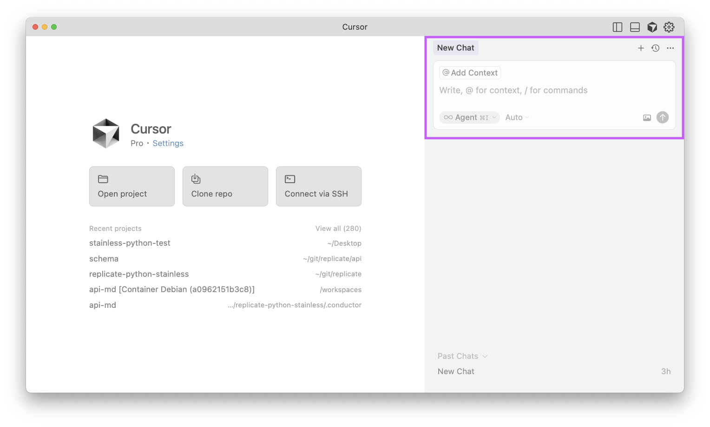

# 🔮 Vibe Coding Workshop

Vibe coding is a new practice in software development where humans chat with AI language models that generate code. The human provides instructions using natural language (English, Spanish, Chinese, etc.) and the model generates code (JavaScript, Python, CSS, HTML, etc) to satisfy those requirements. It's an iterative process where human and machine work together to build and improve an app, website, game, tool, or document through a long-running conversational dialogue. The term "vibe coding" was [coined by Andrej Karpathy](https://x.com/karpathy/status/1886192184808149383) in early 2025.

To vibe code is to "give in to the vibes", disregarding the specific implementation details of the code you're generating, and instead improving your project through natural language prompts based on the results you see, rather than the inner workings of the code.

In this workshop, you'll **learn how to vibe code using Cursor and p5.js**. If you don't know what those things are, don't worry. We'll cover that!

## Prerequisites

You will need:

- A computer
- An internet connection
- An open mind
- [Cursor](https://www.cursor.com/), a code editor with AI superpowers (Free to start / Paid features for advanced use)

## What is p5.js?

[p5.js](https://p5js.org/) is a friendly tool for learning to code and make art. It is a free and open-source JavaScript library built by an inclusive, nurturing community. p5.js welcomes artists, designers, beginners, educators, and anyone else!

p5.js is a port of the popular [Processing](https://processing.org/) project, but written in JavaScript (instead of Java) so it works in web browsers.

p5.js has been around for a long time and it's well documented, so the large language models of the world have lots of context about p5.js in their training data. That makes it a great tool for vibe coding, as AI models can write working code for p5.js apps without much help.

Check out the [p5.js website](https://p5js.org/examples/) for examples of what you can do with it.

## What is Cursor?

[Cursor](https://www.cursor.com/) is a code editor with AI superpowers.

Cursor is built on top of VS Code, the popular open-source code editor from Microsoft. VS Code is free and open-source, and is used by millions of developers around the world. Cursor is basically the same thing as VS Code, but with some extra features for writing code with AI assistance.

Cursor is also a venture-backed startup that's raised 1 billion dollars and is valued at 10 billion dollars.

## Cursor Commands

Cursor has [lots of keyboard shortcuts](https://docs.cursor.com/configuration/kbd), but there are a few that are particularly useful:

- <kbd>cmd + shift + p</kbd> (Mac) / <kbd>ctrl + shift + p</kbd> (Windows/Linux) - Open the Command Palette. The meta-keyboard shortcut ... kinda like Spotlight on Mac. Type stuff and run it.

And these are the AI-powered commands:

- <kbd>cmd + k</kbd> (Mac) / <kbd>ctrl + k</kbd> (Windows/Linux) - Edit at the current line or block of selected code
- <kbd>cmd + l</kbd> (Mac) / <kbd>ctrl + l</kbd> (Windows/Linux) - Edit the current file
- <kbd>cmd + i</kbd> (Mac) / <kbd>ctrl + i</kbd> (Windows/Linux) - Edit the whole project

Mnemonics for your convenience:

- **k** is for kitty (small) 😻
- **l** is for lion (large cat) 🦁
- **i** is for infinity (whole project) 🌎

## Step 1: Set up a new project

Create a new folder called `vibes` on your computer.

Open Cursor.

In Cursor, click **File > Open Folder...** and select the `vibes` folder you just created.

## Step 2: Commence vibing

Notice the pane on the right side of the Cursor window that says **New Chat**. This is the chat interface where you have a conversation with the AI "agent".

☝️ (If you don't see this pane, type <kbd>cmd + i</kbd> (Mac) / <kbd>ctrl + i</kbd> (Windows/Linux) to open it)

Now type an instruction like this:

> **Create an index.html with a simple p5.js setup using CDN-hosted libraries.**

Cursor will take a minute to think before generating some code. When it's done, you should see a new file called `index.html` in your project directory. It should look something like this:

Let's break down what you did:

- You gave it an instruction about a specific file to create
- You mentioned the popular p5.js library
- You asked for CDN-hosted libraries. This means our code can refer to a script that's hosted on a CDN (Content Delivery Network) like [unpkg](https://unpkg.com/) or [jsDelivr](https://www.jsdelivr.com/), so we don't have to bother downloading and configuring it in our project.

In response to this, Cursor did the following:

- Examined the contents of your working directory (the `vibes` folder)
- Created an `index.html` file
- Added some code to the `index.html` file based on the instruction you gave it.
- Asked you to accept or reject the changes.

## Step 3: Accept or reject the changes

Now hit <kbd>cmd + y</kbd> (Mac) / <kbd>ctrl + y</kbd> (Windows/Linux) to accept the changes, or <kbd>cmd + n</kbd> (Mac) / <kbd>ctrl + n</kbd> (Windows/Linux) to reject the proposed changes and add further instructions.

## Step 4: Open your project in a browser

Let's see what it looks like in a browser.

Find your project folder in your computer's file explorer/finder and double-click `index.html` to open it in your default browser.

## Step 5: Save your progress

You should now have something that works. Yay!

At this point, you might want to save your progress. While version control isn't required for vibe coding, it's a useful practice that lets you track changes and restore previous versions if needed. Check out [git.md](./git.md) to learn about Git and how to use it.

## Step 6: Continue vibing

Now that you have a working p5.js project, you can start to vibe.

Here are some prompts you can try to take your project to the next level:

> Generate a side-scrolling game like super mario bros.

---

> Create a visualizer for mic input that maps frequencies to colorful dancing shapes.

---

> Create a motion detection system that uses the webcam to replace pixels in the image with ascii characters.

---

> Make an interactive particle system where particles are attracted to the mouse and leave colorful trails.

---

> Create a generative art piece using recursive patterns and the noise() function for organic movement.

---

> Build a physics simulation with bouncing balls that interact with each other using vectors.

---

> Create an interactive soundscape where clicking creates ripples that generate tones based on their size and speed.

---

> Build a cellular automaton like Conway's Game of Life with custom rules and colorful cell states.

---

> Generate a fractal tree that responds to wind simulation using noise and transforms.

---

> Create a three-dimensional structure that you can navigate through using the keyboard or mouse. Take advantage of P5 "orbit controls".

## Step 6: Generate a README!

Once you've got your project into a state that you're happy with, you can generate a README.md file to document your project. Having a README makes your project more approachable to collaborators, so they know what it does and how to use it.

Type this into the chat:

> **Generate a README.md file for this project. Keep it short and sweet.**

## Tips

- **Consider saving your progress**. While not required, using version control tools like Git can help you track changes and restore previous versions. See [git.md](./git.md) for more info.

- **Don't ask leading questions!** The AI will tend to agree with you. For example, instead of asking a question like "Do the red dots represent nodes in the graph?", try something like "What do the red dots represent?"

- **Use URLs to give the AI specific reference material**. You can paste in a URL to a website to give the AI specific reference material for use when generating code.

- **Start over by making new files** If you want to start over, just make a new file. The AI will usually be able to figure out what you want to do based on the context of the project.

## Examples

- [Vibe coding an iOS app](https://x.com/karpathy/status/1903671737780498883)
- [Vibe coding menuGen](https://karpathy.bearblog.dev/vibe-coding-menugen/) - a web app that converts text-based restaurant menus into visual menus

## Alternative tools

Cursor is currently one of the most popular tools among professional developers, but there are lots of other tools out there for vibe coding. Here are some popular ones:

| Tool                         | Core Use Case                          | Ideal For                          |
|-----------------------------|----------------------------------------|------------------------------------|
| [Claude Code](https://www.anthropic.com/claude-code)                 | Debugging, refactoring, Git work       | Senior devs, long coding sessions  |
| [GitHub Copilot](https://github.com/features/copilot)              | In-editor suggestions                  | Everyday coding                    |
| [v0](https://v0.dev/)                          | Front‑end UI generation                | UX designers, React devs           |
| [Val Town](https://val.town/)                   | TypeScript cloud functions             | Backend prototyping                |
| [Lovable](https://lovable.dev/)                     | Full‑stack app creation via prompts    | Non‑tech builders, prototyping     |
| [Replit](https://replit.com/)                      | Collaborative, multi‑language coding   | Students, generalists              |
| [Windsurf](https://windsurf.com/)                    | Agentic code IDE + preview             | Power developers, teams            |
| [LM Studio](https://lmstudio.ai/)                   | Local LLM experimentation & code       | LLM enthusiasts, developers        |
| [Bolt](https://bolt.new/)                        | UI prototyping                         | Front‑end designers                |
| [Superwhisper / Composer](https://example.com/)     | Voice/prompt-driven builds             | Experimental use                   |
| [Aider](https://aider.ai/)                       | Context-specific code output           | Developers needing fine control    |

