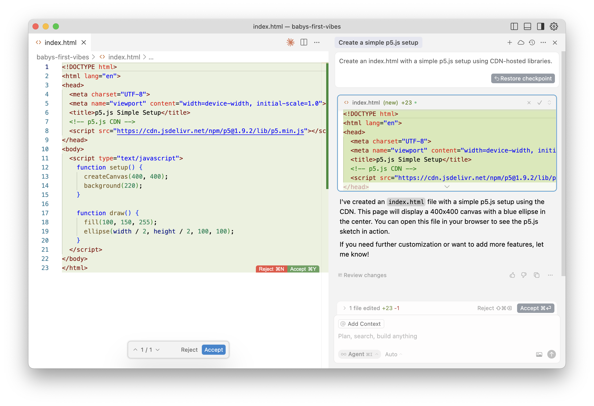

# Vibe Coding Workshop

Hello! Let's do some vibe coding!

## What is vibe coding?

The term "vibe coding" was coined by Andrej Karpathy in early 2025:

> There's a new kind of coding I call "vibe coding", where you fully give in to the vibes, embrace exponentials, and forget that the code even exists. It's possible because the LLMs [...] are getting too good. Also I just talk to Composer with SuperWhisper so I barely even touch the keyboard. I ask for the dumbest things like "decrease the padding on the sidebar by half" because I'm too lazy to find it. I "Accept All" always, I don't read the diffs anymore. When I get error messages I just copy paste them in with no comment, usually that fixes it. The code grows beyond my usual comprehension, I'd have to really read through it for a while. Sometimes the LLMs can't fix a bug so I just work around it or ask for random changes until it goes away. It's not too bad for throwaway weekend projects, but still quite amusing. I'm building a project or webapp, but it's not really coding - I just see stuff, say stuff, run stuff, and copy paste stuff, and it mostly works.

Examples:

- [Vibe coding an iOS app](https://x.com/karpathy/status/1903671737780498883)

## What is Cursor?

Cursor is a code editor with AI superpowers.

Cursor is built on top of VS Code, the popular open-source code editor from Microsoft. VS Code is free and open-source, and is used by millions of developers around the world. Cursor is basically the same things as VS Code, but with some extra features for writing code with AI assistance.

Cursor is also a venture-capital backed startup that's raise 1 billion dollars and is valued at 10 billion dollars.

## Prerequisites

You will need:

- A computer
- An internet connection
- An open mind

## Step 0: Install software

In this workshop we will use the following software:

- [Cursor](https://www.cursor.com/) - Code editor with AI superpowers (Free to start / Paid features for advanced use)
- [GitHub Desktop](https://github.com/apps/desktop) - Free and open-source software for easily working with Git and GitHub.

Optional:

- [Terminal](https://www.google.com/search?q=terminal+mac) - A command line tool for interacting with your computer. If you have a Mac, you can open it by pressing `cmd + space` and typing `terminal`. If you're on Windows, you may not have a terminal installed.
- [GitHub](https://github.com/) account (optional) - A place to store, publish, and collaborate on your code. (Free to start / Paid features for advanced use)


## Cursor Commands

Cursor has [lots of keyboard shortcuts](https://docs.cursor.com/configuration/kbd), but there are a few that are particularly useful:

- <kbd>cmd + k</kbd> - Edit at the current line or block of selected code
- <kbd>cmd + l</kbd> - Edit the current file
- <kbd>cmd + i</kbd> - Edit the whole project

## Step 1: Set up a new project

Create a new folder called `vibes` on your desktop.

```
cd ~/Desktop
mkdir vibes
```

Change into the directory:
```
cd vibes
```

(Optional) create a new git repository in your project directory:

```
git init
```

Open the new directory in Cursor:

```
cursor .
```

## Step 2: Dive in

In cursor, type <kbd>cmd + k</kbd> to open Agent mode.

Type an instruction like this:

> Create an index.html with a simple p5.js setup using CDN-hosted libraries.

Cursor will take a minute to think, consulting an AI oracle, before generating some code. When it's done, you should see a new file called `index.html` in your project directory. It should look something like this:



## Step 3: Set it up to use a CDN

## Step 4: Sprinkle in some React

## Step 5: Add tailwind for styles

## Step 6: 

## Step 10: Use URLs

Paste in a URL to a website and see what happens!

## Dangers and limitations of vibe coding

- Vibe code is not always correct
- Vibe code is not always safe
- Vibe code is not always efficient
- Vibe code is not always easy to understand
- Complex systems are harder to code with AI

## Alternatives

We won't be covering them in this workshop, but there are many great tools out there for vibe coding. Here are some popular ones:

- Val Town
- Lovable
- v0
- Replit
- Windsurf
- Claude Code