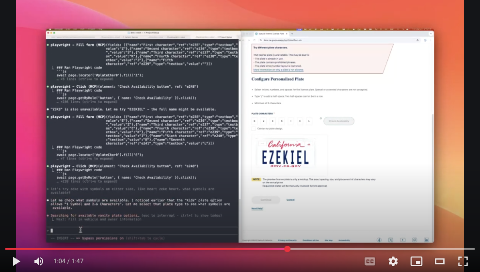

# Surfing with Claude 🏄🏻‍♀️ 

This tutorial shows you how to use Claude Code with the Playwright MCP server to perform fully automated and intelligent web surfing directly from your terminal.

## What?

- Claude is a large language model from Anthropic. It's kinda like ChatGPT, but software developers like it more.
- Claude Code is Anthropic's official command-line interface for Claude. It's a chat interface that can read files, write files, write code, run commands, and more.
- Playwright is a browser automation tool that allows you to control a browser programmatically. Like driving Chrome or Safari with no hands!
- Playwright MCP is a server that allows you to use Playwright from Claude Code.

## Demo

Watch a live demonstration of Claude Code with Playwright MCP in action: [https://youtu.be/0AX3z5dA4EY](https://youtu.be/0AX3z5dA4EY)

<a href="https://youtu.be/0AX3z5dA4EY">
  
</a>

## Installation

First, install Node.js from [https://nodejs.org](https://nodejs.org) and verify it's working:

```bash
node --version
npm --version
```

Install Claude Code, Anthropic's official CLI:

```bash
npm install -g @anthropic-ai/claude-code
claude --version
```

Add the Playwright MCP server to Claude Code:

```bash
claude mcp add playwright npx '@playwright/mcp@latest'
```

## Usage

Time to fire up Claude Code and start surfing!

Start Claude Code and check that the Playwright server is available:

```bash
claude
```

Then ask Claude:

```
What MCP tools do you have available?
```

You should see Playwright-related tools in the response.

## Using Playwright MCP for Web Surfing

### Basic Commands

Once configured, you can ask Claude to perform various web browsing tasks:

Navigate to a website:

```
Navigate to https://example.com and tell me what you see
```

Take screenshots:

```
Go to https://github.com and take a screenshot
```

Fill out forms:

```
Go to the GitHub login page and show me the form fields
```

Extract information:

```
Visit https://news.ycombinator.com and list the top 5 stories
```
